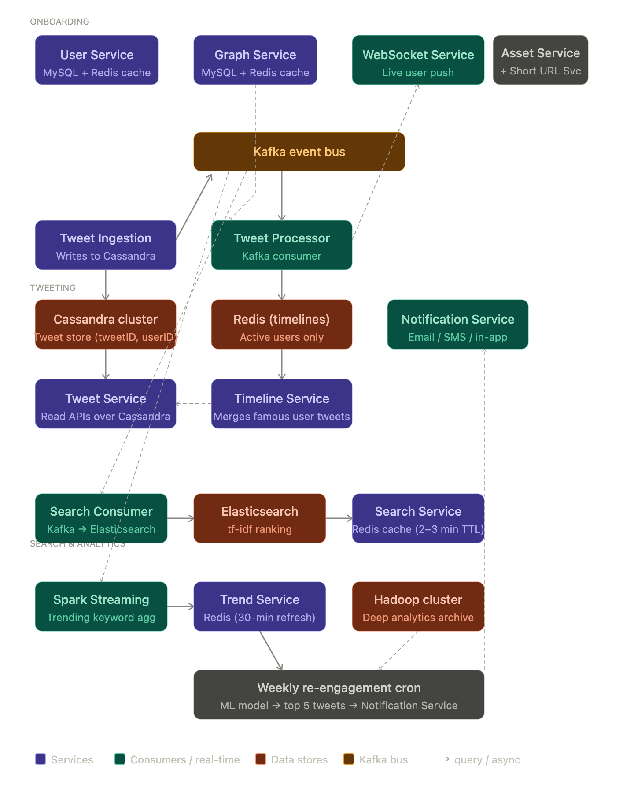

## Functional requirements

- **Tweet**: Post content up to 140 characters, optionally with images, videos, or external links
- **Retweet**: Share another user's tweet (similar to Facebook's "Share")
- **Follow**: A directed/unidirectional relationship — following someone doesn't mean they follow you back
- **Search**: Search across all tweets by keyword or topic (used for trend analysis and exploring discussions)

---

## Non-functional requirements (NFRs)

- **Read-heavy**: ~100× more reads than writes
- **Fast rendering**: Home timeline must load in under 1 second
- **Fast write acknowledgement**: Posting a tweet should return a success response quickly
- **High availability**: System should never go down
- **Eventual consistency is acceptable**: A tweet may appear in followers' feeds up to ~20 seconds late — that lag is okay as long as rendering is fast when it does appear

---

## Scale estimates

- 150M Daily Active Users (DAU)
- 350M Monthly Active Users (MAU)
- 1.5B total user accounts (includes organizations and possibly fake accounts)
- 500M tweets/day → ~5,700 tweets/sec average, ~12,000 tweets/sec at peak

---

## User classification

Before diving into architecture, users are split into 5 categories — each handled differently:

| Category | Definition |
|---|---|
| **Famous** | Celebrities, politicians, CXOs — very large follower counts |
| **Active** | Accessed Twitter in the last 3 days |
| **Live** | Currently online on the platform right now (subset of active) |
| **Passive** | Have accounts but haven't logged in recently (>3 days) |
| **Inactive** | Soft-deleted/deactivated accounts — no action needed |

---

## Architecture overview

The system is broken into 3 major flows:
1. User Onboarding
2. Tweeting (read + write)
3. Search & Analytics

> Key principle: For a read-heavy system, **precompute and cache aggressively**. Almost every component uses caching to keep latencies low.

> Convention used: Green = UI / user-facing; Black = Load Balancers (also handle auth); Blue = internal services / Kafka consumers; Red = databases, clusters, or open-source tools

---

## Flow 1 — User onboarding

### User Service
- Source of truth for all user data (profile, login, registration)
- Exposes GET APIs (by userID, by email), POST APIs (update user), and a **bulk GET API** (fetch info for 30–40 users in a single request — used for follower screens)
- Sits on top of a **clustered MySQL** database (user data is relational and finite — MySQL makes sense here)
- All reads are served from a **Redis cache** (user data changes infrequently, so cache hit rate is high)
  - Cache miss → query a MySQL read slave → store in Redis → return to client
  - Redis key: `userID` → value: user object

### Graph Service
- Manages the social graph — who follows whom
- Exposes APIs to: add a follow link, get all followers of a user, get all users a user follows, and bulk variants of the above
- Backed by a **clustered MySQL** (with sharding — this dataset grows large)
  - Logically: table with `userID`, `followerID`, `timestamp`
- Again cached in **Redis** — two entries per user: list of followers, and list of people they follow
- Follow relationships change infrequently per user → cache is very effective here

### Analytics events
- Any user interaction (e.g., lingering on a tweet) is sent as an event through a Load Balancer to an **Analytics Service** → pushed into **Kafka** for downstream processing

### Live user tracking (WebSocket Service)
- Keeps a persistent **WebSocket connection** with every live user
- Used to push real-time events (new tweets, tag notifications) directly to the user's app without them needing to refresh
- When a user disconnects, an event is fired to Kafka → User Service updates cache: user type changes from "live" → "active", last-seen timestamp recorded
- Other services use this user-type info to adapt behavior

---

## Flow 2 — Tweeting (write path)

### Handling media (Asset Service)
- Responsible for all images and videos in tweets
- Behaves like a video hosting platform (similar to Netflix/Prime design)
- Not covered in detail here — treated as a solved sub-problem

### URL shortening (Short URL Service)
- Tweets are limited to 140 characters, so long URLs must be shortened
- Works like TinyURL — not covered in detail here

### Tweet Ingestion Service
- Entry point for all new tweets (text + short URL references)
- Stores tweet in **Cassandra** (chosen over HBase for simpler setup — no ZooKeeper or Hadoop cluster needed)
  - Logical schema: `tweetID`, `userID`, `tweet_content`, + metadata
- After storing, fires an event to **Kafka**: `{ tweetID, userID, content }`
- Ingestion service only handles writes — no GET APIs

### Tweet Service
- Source of truth for reading tweet data
- Owns the Cassandra schema
- Exposes: get tweet by ID, get all tweets of a user, support timeline generation

---

## Flow 2 — Reading timelines (read path)

### Two types of timelines
- **User Timeline**: All tweets/retweets by you specifically → `SELECT * WHERE userID = you`
- **Home Timeline**: Tweets from everyone you follow → `SELECT * WHERE userID IN [list of followees]`

Naively querying Cassandra at runtime for home timelines would be too slow at 150M DAU. Instead, **timelines are precomputed and cached in Redis**.

### Tweet Processor (Kafka consumer)
- Consumes new tweet events from Kafka
- Queries Graph Service to get all followers of the tweet author
- **Updates each follower's cached timeline in Redis** with the new tweet
- Example: User `u1` tweets `t1`; `u1` is followed by `u2`, `u3`, `u4` → Tweet Processor prepends `t1` to each of their Redis timelines

### Timeline Service
- All UI requests for timelines come here
- For **active users**: timeline is already in Redis → instant return
- For **passive users**: Redis has no entry → Timeline Service:
  1. Queries Graph Service for who this user follows
  2. Queries Tweet Service for their tweets
  3. Sorts by timestamp
  4. Stores in Redis and returns to UI
- For **live users**: Tweet Processor detects the user is online, puts a notification event back into Kafka → WebSocket Service pushes new tweet directly to the app → user sees it without polling

### Problem: Famous users (e.g., 75M followers)
- If Donald Trump tweets, that's 75M Redis timeline updates — extremely expensive
- **Solution**: Don't update Redis for famous users' tweets at ingestion time
- Instead, Timeline Service **merges famous users' tweets on-read**:
  1. Pull cached timeline from Redis (normal users' tweets only)
  2. Query Graph Service to identify which famous users this person follows
  3. Query Tweet Service for those famous users' recent tweets
  4. Merge the two, store back in Redis with a timestamp `T`
  5. Next request: if `T` was >5–10 min ago, re-fetch famous tweets; if `T` was <5 sec ago, return cache directly

- **Famous-to-famous following** (e.g., Trump follows Musk): Tweet Processor handles this — when a famous user tweets, only update the Redis timelines of the other famous users who follow them

---

## Bottlenecks to watch
- **Cassandra**: queried heavily — needs careful tuning
- **Redis**: entirely in-memory — needs sufficient RAM and proper TTL policies to prevent stale/junk data buildup; does support disk persistence for fault tolerance
- **Kafka**: central to the whole architecture — must be sized carefully

All three (Cassandra, Redis, Kafka) are **horizontally scalable** — adding machines handles growth.

---

## Flow 3 — Search

### Search Consumer (Kafka consumer)
- Consumes all new tweet events from Kafka
- Indexes them into **Elasticsearch** (Lucene-backed, supports text search and relevance ranking)
- Relevance is based on tf-idf (Term Frequency – Inverse Document Frequency)

### Search Service
- Accepts search queries from the Search UI
- Queries Elasticsearch and returns results
- **Caches results in Redis with a short TTL (2–3 minutes)**
  - Rationale: when something is trending, many users search for the same term — recomputing isn't necessary
  - Cache hit → return immediately; miss → hit Elasticsearch, store in Redis, return
  - Reduces hardware cost significantly

- **Lag is acceptable**: if a tweet was just posted and it's not yet indexed in Elasticsearch, that's fine

---

## Flow 3 — Analytics & Trending

### Trending topics
- A **Spark Streaming** consumer reads all tweet events from Kafka
- Tokenizes tweet text (splits by whitespace), removes stop words ("a", "the", "is")
- Aggregates most common words over the last 1 hour
- Every 30 minutes, writes results to a **Trend Service** (backed by Redis — temporary data, no persistent DB needed)
- A **Trends UI** displays trending topics — also broken down by geography (what's trending in India vs. France)

### Hadoop cluster
- All tweets are also archived into a **Hadoop cluster** for deep analytics
- Supports queries like: most retweeted user, most engaging account, etc.

### Re-engagement notifications
- A weekly cron job pulls all **passive users**
- An ML model identifies which tweets from the past 7 days are most relevant to each passive user
- Top 5 relevant tweets are sent via **Notification Service** (email / SMS / in-app, based on user communication preferences)
- Notification Service queries User Service for contact info and preferences

---

## Architecture diagram

---

## Overall summary

This is a design for a read-heavy, always-available platform that handles 500M tweets/day. The core architectural insight is that **you cannot compute timelines at request time at this scale** — you have to precompute. This drives the entire design: Kafka decouples writes from fan-out, Tweet Processor pushes updates into Redis, and Timeline Service just does a cache lookup for active users.

The other major insight is that **not all users are equal**. Famous users (huge follower counts) are explicitly excluded from the fan-out model to avoid catastrophic write amplification. Passive users skip Redis entirely and have their timelines built on-demand. Live users bypass Redis entirely and get pushed updates via WebSocket.

---

## Key takeaways

- **Precompute for read-heavy systems**: Cache timelines in Redis for active users rather than recomputing per request
- **User segmentation drives architecture**: Treating famous, active, live, and passive users differently is what makes the system tractable at scale
- **Kafka is the backbone**: Nearly every async flow — tweet fan-out, search indexing, analytics, live notifications, re-engagement — runs through Kafka
- **Famous users are a special case**: Fan-out to 75M followers per tweet is not viable; merge on-read instead
- **Eventual consistency is a feature, not a bug**: The NFRs explicitly allow up to ~20 seconds of delivery lag, which unlocks async processing
- **Horizontal scalability is non-negotiable**: Cassandra, Redis, and Kafka must all be clustered and sized to scale out by adding nodes
- **Redis TTLs and cleanup matter**: Without TTL policies, Redis fills with stale data — important operational concern at this scale