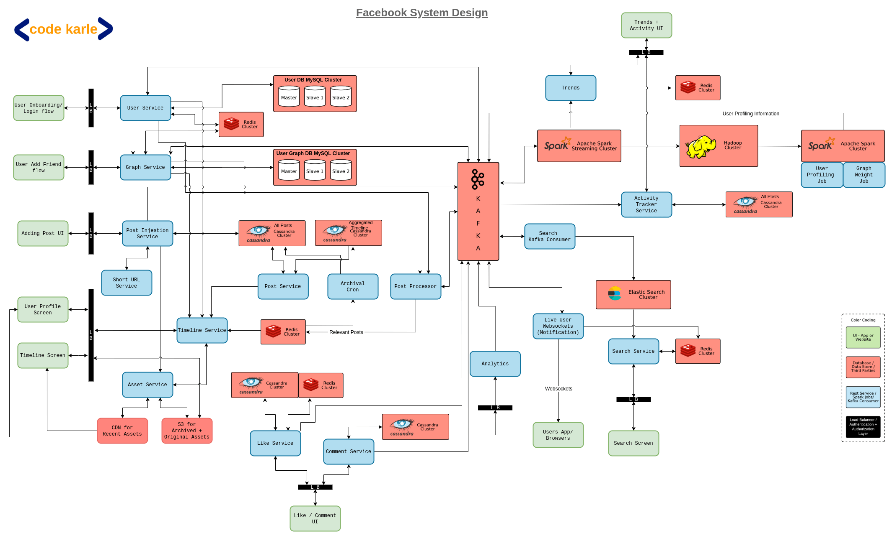

# System Design: Social Network (Facebook Scale)

_Based on CodeKarle — Facebook System Design_

---

## Overview & Context

- This design is an extension of the **Twitter system design** — it's recommended to watch that first, as this video builds on it and introduces changes to handle **significantly larger scale**
- The same architecture applies to **Instagram, LinkedIn, Twitter**, or any social network
- The core challenge: designing a system that scales to Facebook's volume **efficiently and cost-effectively**

---

## Functional Requirements

| Feature                  | Details                                                                        |
| ------------------------ | ------------------------------------------------------------------------------ |
| **Post**                 | Create a post — can contain text, image, video, or a URL                       |
| **Like**                 | Like a post                                                                    |
| **Comment**              | Comment on posts (not on comments, for simplicity)                             |
| **Share**                | Share a post                                                                   |
| **Add Friend**           | Non-directional relationship — if A is B's friend, B is A's friend             |
| **Timeline**             | See posts from all your friends in a unified feed                              |
| **Other Profiles/Posts** | Visit a user's profile or view their post history                              |
| **Activity Log**         | Every action a user takes (post, like, comment, search) is tracked and visible |

> **Friendship is non-directional**, but there's a concept of **friendship weightage** (directional) — covered in the Analytics section.

---

## Non-Functional Requirements

- **Read-heavy system** — for every 1 write, there are potentially hundreds of reads
- **Fast rendering and posting** — low latency is required, but some **lag is acceptable**
  - Lag ≠ Latency: If a friend sees your post 10–20 seconds late, that's fine. But once they see it, the page must load fast
- **Access pattern** — posts get heavy traffic right after creation, peak, then decay. This is especially relevant for **images and videos** (used to optimize CDN usage and storage cost)
- **Global platform**:
  - Must support multiple device types and screen sizes
  - Must handle multiple languages
  - Needs **geographically distributed servers** for users on low-bandwidth connections

---

## Scale (Facebook's Numbers)

- **1.7 Billion** Daily Active Users (DAU)
- **2.6 Billion** Monthly Active Users (MAU) _(Facebook only, excluding WhatsApp and Instagram)_
- **95% of users** access via **mobile phones** → optimizations specifically for mobile are necessary

**Per-minute activity volume:**

| Action         | Volume/Minute |
| -------------- | ------------- |
| Image uploads  | 150,000       |
| Status updates | 300,000       |
| Comments       | 500,000       |

> These numbers are **significantly larger than Twitter's**, which is why we can't cache everything. This drives several design changes.

---

## User Segmentation

Users are split into **5 categories** for targeted optimizations:

| Type         | Definition                                          |
| ------------ | --------------------------------------------------- |
| **Famous**   | Users with a very large number of friends/followers |
| **Active**   | Accessed Facebook within the last ~3 days           |
| **Live**     | Currently browsing the platform right now           |
| **Passive**  | Infrequent users — no content pre-cached for them   |
| **Inactive** | Deactivated/fake/soft-deleted accounts              |

---

## Architecture Walkthrough

### Color Convention Used in Diagrams

- 🟢 **Green** — User interaction points (browsers, mobile apps)
- ⚫ **Black** — Load Balancers + Reverse Proxy + Auth/AuthZ layer
- 🔵 **Blue** — Internal web services / Kafka consumers / Spark jobs (code written by us)
- 🔴 **Red** — Databases, caches, Kafka clusters, Hadoop, CDNs, third-party tools

---

## Component 1: User Service

**Purpose:** Handles all user-facing operations — onboarding, login, profile creation, and profile updates.

- Primary data source for all user information
- Exposes APIs: `getUserById`, `updateUser`, `getUsersBulk`, etc.

**Data Stores:**

- **Clustered MySQL** — User data is structured and relational, not updated frequently (name, email, location rarely change) → MySQL is a great fit
- **Redis cluster** — Caches user information to avoid repeated DB hits
  - On cache miss: query MySQL → update Redis → return response
  - On cache hit: return directly from Redis

**Event Flow:**

- On user creation or update → event pushed to **Kafka**
  - New accounts: trigger **fraud/fake account detection**
  - Account updates (e.g., phone number change): notify the Notification Service

---

## Component 2: Graph Service

**Purpose:** Manages the entire social graph — friend relationships and friendship weights.

- Exposes APIs like: "who are the friends of user X?" — used heavily by other services
- Stores **relationship data** and **weightage** (how close two users are)

**Data Stores:**

- **Clustered MySQL** — Core table: `(userID, friendID)` — simple, structured, relational
- **Redis cluster** — Key: `userID`, Value: `list of friends` — fast lookup without hitting MySQL on every request

---

## What's Stored in Redis (Shared Across Services)

Redis is the backbone of speed in this system. The key is always `userID`. Values include:

| Key              | Value                                                                         |
| ---------------- | ----------------------------------------------------------------------------- |
| User Details     | Profile info (name, email, etc.)                                              |
| Friends List     | List of friends of a user                                                     |
| User Type        | Active / Live / Famous / Passive                                              |
| Relevance Tags   | Interest tags (e.g., sports, politics) — used to filter who sees what content |
| Last Access Time | Used for online status in chat, activity tracking                             |

**Relevance Tags** — Instead of sending every post to all friends, the system targets only those whose interest tags match the post's topic. This improves engagement and avoids showing irrelevant content. Tags are generated by the analytics pipeline (discussed later).

---

## Component 3: Post Creation Flow

### Supporting Services

**Short URL Service**

- When a post contains an external URL, it gets converted to a short URL
- Allows tracking of clicks and link behavior
- Covered in detail in a separate CodeKarle video

**Asset Service (Image & Video)**

- Handles media uploaded with posts
- Responsibilities:
  - **Format conversion** — multiple resolutions, aspect ratios, bandwidths (optimized for mobile vs. desktop)
  - **CDN management** — new/popular media lives on CDN; once access decays, it's moved to **Amazon S3** to free CDN capacity
  - **Re-promotion** — if an old photo suddenly gets popular again (e.g., a celebrity comments on it), it detects the spike via hit rate monitoring and pulls it back from S3 to CDN

---

### Post Creation — Step by Step

1. **User submits a post** via mobile or web → hits **Post Injection Service**
2. Post Injection Service:
   - Sends media to **Asset Service** (if image/video)
   - Sends URLs to **Short URL Service**
   - Assembles final post content
3. Final post is written to **Cassandra**
   - Chosen over MySQL because of massive write volume (thousands/sec)
   - HBase is an alternative but Cassandra is simpler to set up
4. **Post Service** is the owner/source of truth for all post data
   - Provides APIs: `getPostById`, `getPostsByIds` (bulk)
5. Post Injection Service publishes a **Kafka event** — its job is done here

---

### Analytics Pipeline (Post Tagging)

6. A **Streaming Consumer** on Kafka picks up the event
7. Applies an **ML classification model** to tag the post (e.g., "this is a sports post")
8. Tagged event is put **back into Kafka** for further processing
9. This is acceptable because **some lag is allowed** — nobody expects to see a post the millisecond it's published

---

### Post Processor — Who Sees the Post?

10. **Post Processor** consumes the tagged Kafka event
11. Queries **User Service + Graph Service** to get all friends of the poster
12. Fetches **Relevance Tags** of each friend
13. Filters the friend list — only those whose interest tags match the post's tags get the post
14. Writes the **post ID** into each qualifying friend's **Redis timeline**
    - Timeline is stored as: `userID → [postID1, postID2, ...]`
    - Only post IDs are stored, not full content (Post Service fetches content on demand)

---

## Component 4: Timeline Retrieval

### Two Types of Timelines

**Type 1: Viewing another user's profile posts**

- Simple: call Timeline Service → query Post Service for all posts by that user → return

**Type 2: Viewing your own feed (all friends' posts)**

1. **Timeline Service** fetches the user's Redis timeline (pre-built by Post Processor)
2. The Redis timeline contains only **normal (non-famous) users' posts**
3. For **famous users' posts**: Timeline Service separately queries Post Service in real-time (same approach as Twitter — avoids writing to millions of timelines)
4. Merges both → sends back to the user
5. Result is optionally cached in Redis with a **timestamp**
   - If timestamp is recent (< few minutes): return cached version
   - If stale: re-fetch famous users' posts and refresh

---

### Live Users — Real-Time Updates

- When Post Processor determines a friend is **live**, it publishes to a separate **Kafka topic**
- **Live User Service** maintains **open WebSocket connections** with all currently active users
- When it receives the Kafka event, it pushes the new post to the relevant user's app instantly
- The app updates the feed without the user needing to refresh

---

## Component 5: Archival Service

**Problem:** Redis can't store timelines forever — it's memory-constrained.

**Solution:**

- Redis holds only **today's timeline data**
- **Archival Service** runs periodically during the day:
  - Fetches all built timelines from Redis
  - Saves them into an **Aggregated Timeline Cassandra** (keyed by `userID + date`)
  - Clears the Redis entries
- When a user scrolls back in time (yesterday's posts, older), **Timeline Service queries Archival Cassandra** instead of recomputing
- This scales to all user types — active, famous, passive — because Cassandra scales horizontally

> **Important:** Cassandra partition keys must be chosen carefully (user ID–based, not date-based) to **avoid hot spots** — where one node handles all today's reads/writes while others sit idle.

---

## Component 6: Likes

**Like Service** — source of truth for all like data

- **Cassandra schema:** `(userID, postID, postType, likeType)`
  - `postType` can be "post" or "comment" (extensible)
  - `likeType` can support upvotes/downvotes/reactions (extensible)
- **Redis** stores **like counts** per post (only for recent posts)
  - Uses atomic **INCR** operation — thread-safe, no race conditions
  - TTL set on Redis entries — expires after a few days when the post goes stale
- Like event also published to **Kafka** → used by Analytics and Activity Tracker

---

## Component 7: Comments

**Comment Service** — source of truth for all comments

- **Cassandra schema:** `(postID, userID, commentText, timestamp, ...)`
- Fetching comments: simple `WHERE postID = X` query
- **No Redis cache needed here** — querying by postID is efficient enough directly on Cassandra (unlike like counts which needed aggregation)
- Comment events also published to **Kafka**

---

## Sharing Posts

- A shared post is just **another post** with a `parentPostID` field pointing to the original
- No separate service needed — handled entirely by the existing Post flow

---

## Component 8: Activity Tracker

**Purpose:** Logs everything a user does on the platform.

- All events (posts, likes, comments, shares, searches) **already flow through Kafka**
- Activity Tracker just **consumes from Kafka** and writes to its own Cassandra

**Cassandra schema:** `(userID, timestamp, action, attributes)`

Examples of `action`:

- `"liked commentID=xyz"`
- `"made postID=abc"`
- `"searched: 'Elon Musk'"`

- Exposes read APIs so users can view their own activity log on a UI

---

## Component 9: Search

_(Same as Twitter design — briefly mentioned)_

- Kafka consumer reads all events → stores content in **Elasticsearch** (optimized for text search)
- **Search Service** queries Elasticsearch and returns results
- Results optionally cached in **Redis** before returning to user
- Search queries are also logged to Kafka → picked up by Activity Tracker

---

## Component 10: Analytics & User Profiling

### User Profiling

**Goal:** Understand what each user is interested in, based on behavior.

- A **Spark Streaming Consumer** reads all activity from Kafka → writes raw data to **Hadoop**
- Batch Spark jobs analyze the data:
  - Which posts did the user like? → Tag them by topic
  - Which posts did they comment on? → Same
  - Aggregated signals → classify user interests (e.g., "sports", "politics")
- Output (user interest tags) published to Kafka → **User Service** reads this and stores tags in Redis against the user ID
- These tags are used by **Post Processor** to decide who sees which post

---

### Graph Weight (Friendship Affinity)

**Problem:** Not all friends matter equally. You may love one friend's posts but never engage with another's.

**Solution — Graph Weight Job:**

- Spark job analyzes interaction data in Hadoop
- For each user, calculates: "whose posts do I engage with the most?"
- Generates a **weighted friend graph** (directional): e.g., "User A engages heavily with User B's content"
- This allows the feed to **prioritize showing posts from friends you care about**

---

### Trends

- Spark Streaming job reads all posts and comments
- Tokenizes text → removes stop words ("a", "the", "is", etc.)
- Counts frequency of remaining words/phrases in a time window
- Results stored in **Redis** (temporary, gets refreshed frequently)
- Trend UI can surface "what's people talking about right now"

---

## Scalability & Monitoring

- **All services scale horizontally** — add nodes as traffic grows (web services, databases, caches, Kafka)
- **Monitoring required on all components:**
  - Web services: latency, throughput, CPU/memory
  - Databases: query volume, disk usage, throughput
  - Caches (Redis): hit rate, memory
  - Kafka: lag, throughput
- **Alerting:** Set thresholds — if any metric spikes beyond acceptable limits, alerts are fired proactively so engineers can respond before users are impacted

---

## Overall Summary

This system handles Facebook-scale social networking through a combination of smart caching, event-driven architecture, and selective content distribution. Unlike a simpler design where every post goes to every friend, this system uses **relevance filtering** and **user segmentation** to make reads fast and writes manageable.

---

## Key Takeaways

| Insight                                    | Why It Matters                                                                                                                        |
| ------------------------------------------ | ------------------------------------------------------------------------------------------------------------------------------------- |
| **Lag ≠ Latency**                          | Accepting 10–20s delivery lag allows async processing pipelines — which enable ML tagging, relevance filtering, and cost optimization |
| **Post IDs, not post content, are cached** | Keeps Redis/Cassandra timelines lightweight; Post Service fetches actual content on demand                                            |
| **Famous user exception**                  | Writing to millions of followers' timelines is infeasible — Timeline Service fetches their posts live and merges at read time         |
| **Relevance Tags reduce noise**            | Targeting posts to interested friends improves engagement and reduces wasted compute                                                  |
| **Access pattern drives CDN strategy**     | Content is promoted to CDN when hot, demoted to S3 when cold — saving cost without sacrificing performance                            |
| **Cassandra partition key matters**        | Date-based keys create hot spots; user ID–based keys distribute load evenly                                                           |
| **Activity Tracker is essentially free**   | Since all events already flow through Kafka, tracking requires no extra instrumentation — just one more consumer                      |
| **Graph Weight personalizes the feed**     | Interaction frequency determines which friends' posts you see more — without explicit user configuration                              |
