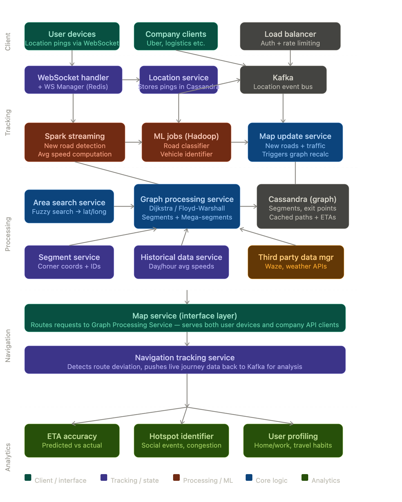
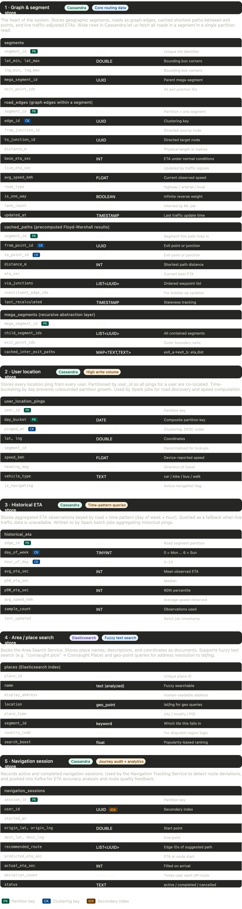

---

## Functional requirements

The system needs to: find the best route between two points, return estimated distance and ETA, optionally offer 2–3 route choices letting users optimise for time vs distance, and be architected in a pluggable way so new data sources (weather, accidents, road closures) can be added without rearchitecting the whole system.

## Core abstraction: segments

The video introduces a concept called a **segment** — a small 1km × 1km geographic tile identified by its four corner coordinates. Every point on earth belongs to a segment. This is the key unit of computation:

- Within a segment, **Floyd-Warshall** is run once to precompute shortest paths between all junctions and all exit points, which are then cached.
- When querying across multiple segments, only **entry/exit points** matter — you don't re-examine roads inside a segment you're just passing through.
- For very long journeys (city-to-city), segments are grouped into **mega-segments**, and the same logic applies recursively — 3 levels of nesting is typically enough.

## Graph model for roads

Roads are modelled as a **directed weighted graph**. Each edge (road) carries multiple weights: distance (km), base ETA (seconds), and average speed. One-way streets are represented by making the reverse direction have infinite weight. This directed model also handles asymmetric traffic patterns.

## Routing algorithm

For a single-segment query, Dijkstra or Floyd-Warshall is used directly. For cross-segment queries, a subgraph is built at runtime using only exit/entry points within a bounding box derived from the aerial distance between the two points (e.g. 20 segments in each direction for a 10km trip), and Dijkstra runs on that smaller graph — far more efficient than running Dijkstra globally.

## Handling traffic and speed

Rather than putting traffic as a graph weight (which would require changing the Dijkstra logic every time a new signal type is added), traffic, weather, and other real-world signals are treated as **modifiers on average speed**. Speed is a function of traffic tier (low/medium/high) and weather (good/bad), each causing a percentage change. This keeps the routing algorithm clean and extensible.

Where real user data is available, observed ETAs follow a **normal distribution** and can be used directly — no need to infer from traffic signals at all. Historical ETAs are also stored by day-of-week and hour-of-day for fallback estimation.

## Dynamic weight updates and recalculation

When a road's ETA changes, the update bubbles up through cached paths at the segment level, then through mega-segments. If the change exceeds a configurable threshold (e.g. 30%), the entire segment is recalculated and the new shortest path replaces the old one, propagating upward to mega-segments that used that path.

## Architecture components

**User location tracking flow:** User devices send periodic location pings via a persistent WebSocket connection (with a WebSocket Manager using Redis to track which handler serves which user). Pings go to the Location Service (Cassandra) and simultaneously into Kafka.

**Spark Streaming jobs** consume from Kafka and run:

- New road detection (organic discovery from movement patterns)
- Average speed computation (used to update graph weights)
- Hotspot identification (anomalous crowd density signals)
- Road classification and vehicle type inference (via Hadoop ML jobs)

**Navigation flow:** A user searches a place via the Area Search Service (ElasticSearch, resolves to lat/long) → Map Service → Graph Processing Service. The Graph Processing Service queries the Segment Service, checks cache, and if needed builds the subgraph and runs Dijkstra. It pulls from live traffic data, Historical Data Service, and Third-Party Data Manager (Waze, weather APIs).

**Navigation Tracking Service** monitors deviations in real time during an active journey and pipes journey data back to Kafka.

## Analytics

From Kafka data: ETA accuracy is measured (predicted vs actual), poorly recommended routes are identified, hotspots and points of interest are inferred, and user profiles are built (home/work locations, travel preferences) purely from location patterns.

## Disputed territories

Google handles disputed borders by **showing different maps based on the user's country of origin** — Indian users see the full territory claimed by India, Pakistani users see Pakistan's claim with a dotted line for the India-China disputed zone, and so on.

Click any box in the diagram above to dive deeper into that component!

---

## DB Design

